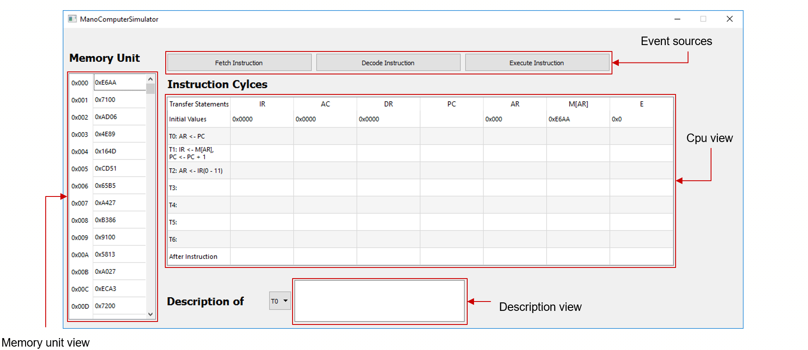
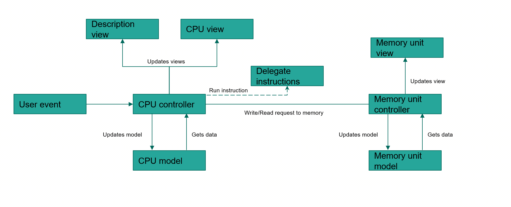
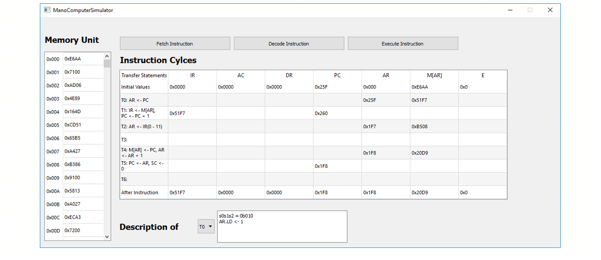

## Mano-Computer-Simulator
An application developed as part of my computer architecture class to model a 16-bit CPU down to its registers and the way it processes instructions and data.  

## Design patterns
&emsp; &#x2756; Model View Presenter (MVP)

&emsp; &#x2756; Delegation

#### Model View Presenter
&emsp; Model &#x2192; Defines the data to be displayed.

&emsp; View &#x2192; Displays the data and routes events to the presenter.

&emsp; Presenter &#x2192; Acts upon the model and the view.

#### Delegation

Using Java 8’s lambda expressions:

```Java
interface StringFunc {
  String func(String s);                                            
}                                                                  
                                                                
void doSomething(StringFunc funk) {                               
  System.out.println(funk.func("whatever"));                      
}                                                                 
                                                                  
doSomething((t) -> t + "asd");                                      
doSomething((t) -> new StringBuilder(t).reverse().toString());   
```                                                              

Using function pointers in c++:

```C++
int doubleIt(int d) { 
  return d * 2;
}

int halveIt(int d) { 
return d / 2;
 }
 
typedef int (*MyFuncT) (int d);

MyFuncT fp = &doubleIt;
cout << fp(3);

fp = &halveIt;
cout << fp(3);
```

## Before all the steps


## Execution flow


## After all the steps


**Note:** This program was created using Qt Creator so you will either need to install it and import the project file or setup your build system's dependecies accordingly
